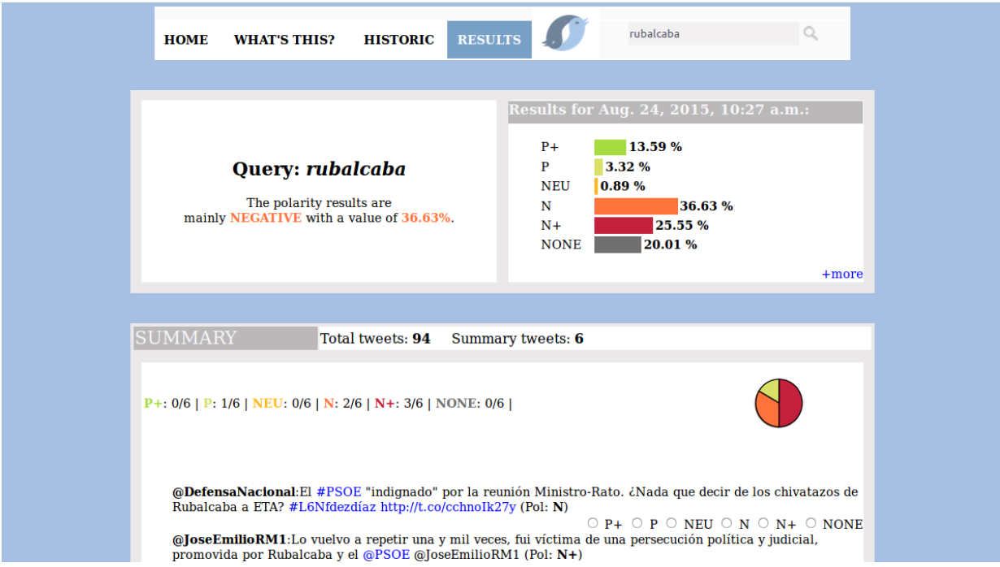

# Twitsentim
This repo contains the web app I developed as a final project for my Bachelor's degree. See more info in the [report](https://riunet.upv.es/bitstream/handle/10251/55471/SELVA%20-%20Desarrollo%20de%20un%20sistema%20de%20an%C3%A1lisis%20de%20sentimiento%20sobre%20Twitter.pdf).

I'm sorry I did not add any usage instructions, but it's been almost 10 years now and I don't remember :s

I honestly never thought anyone could be interested in a class project.
